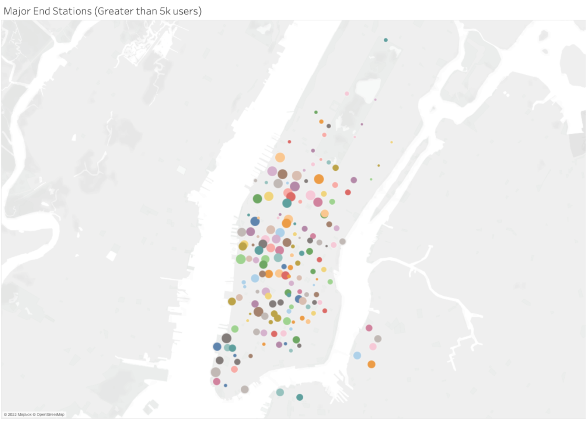

# NYC_CitiBikes
---

# Overview 

## Purpose

The purpose of this project is to use the bike sharing data to create multiple charts to visualise the data in different ways.

## Aim

The aim of this paper is to use Jupyter notebooks and Tableau for data visualisation. 

---
# Results 

Using the CitiBike data can be visualised in multiple manners as seen below. These charts below will be used to gain insight that will help with the proposal.

### Checkout Times for Users 

The graph above shows the number of users for a given trip duration. 

### Checkout Times for Users, by Gender

The graph above shows the number of users for a given trip duration, but broken out by gender, with orange representing 'male', blue representing 'female', and red indicating 'unknown'. 

### Trips by Weekday for Each Hour

The graph above is a heatmap of the number of trips taken by hour, over the course of the week. The darker the spot on the heatmap, the more rides were taken, and vice versa.  

### Trips by Gender (Weekday per Hour)

Similar to the graph above, this graph is showing the most popular times for trips over the week, broken out by gender. 

### User Trips by Gender by Weekday

The final graph shows trips by usertype, 'customer' or 'subscriber', as well as gender, broken out over the week. 

#### Two Additional Findings

These two additional findings display the busiest starting and ending stations.

---
## Summary

[link to dashboard](https://public.tableau.com/app/profile/priya.mcnamara/viz/NYCCitiBikeChallenge_16496320948550/NYCCitiBikeData)

With the help of Tableau and Python, a csv file can be read and data extracted, and be used to create data graphs and other visualisation aids. From these graphs above, it can be determined that the average trip duration is 6 minutes and it appears males checkout the bikes more often than females. In addition to this, it can be seen that Friday through Monday, the most popular times for usage of the bikes is 6 AM - 8 AM, and 5 PM - 6 PM, which naturally coincides with the average work day, and it is more popular for men. 

When looking at the graph of Customers vs Subscribers, it shows that a lot more men are subscribed that women, which could be an indication of why more men are using the bikes. Though there aren't as many female subscribers, there are more female subscribers than there are female customers. 

The final two graphs provide some additional information into where users are going to/coming from. It can be seen that they are mostly concentrated in the middle of the city with a few outside Manhattan.

For a bike sharing program to succeed in Des Moines, two additional visualisations are suggested for future analysis. The first suggestion would be to look into current public transport users in both NYC and Des Moines. NYC has a history of using public transport, so the usage of bikes could be due to a switch from a train, or a bus, as opposed to a car. If there isn't other public transport systems in Des Moines currently to help aid the use of the bike-sharing programme, or if people aren't willing to ditch their cars, this programme may not be as successful there. 

Another suggestion would be to look at weather data for both Des Moines and NYC. On average, there are 224 sunny days per year in New York, compared to 204 days for Des Moines (the US average is 205). Additionally, New York averages 25.3 inches of snow per year, whereas Des Moines averages 32.9 inches of snow per year, which would affect people's ability to travel on bikes, also causing a potential disruption for this programme.
